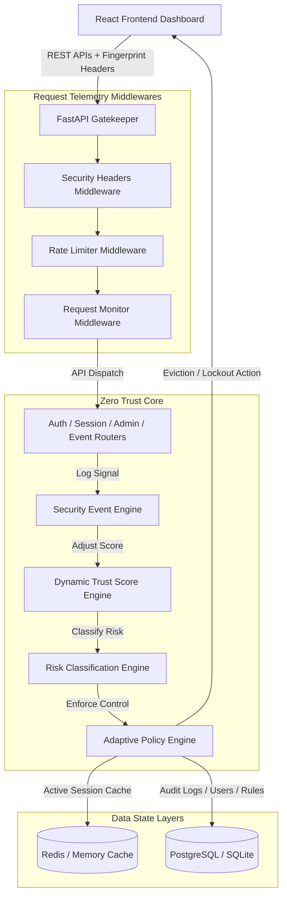

# Dynamic User Trust Scoring and Adaptive Session Protection for Zero Trust Security

An advanced undergraduate cybersecurity project implementing a continuous evaluation Zero Trust security model. The system features a modular Python FastAPI backend and a premium React + TypeScript + Vite administrative and user telemetry dashboard.

---

## 🔒 Project Overview

Traditional perimeter-based security architectures rely on login-time authentication as the final authorization boundary. This project demonstrates a **Zero Trust Security Architecture**, where authenticated users are continuously evaluated throughout their active session. 

A dynamic, explainable **Trust Score (0–100)** is computed in real-time based on security events (device fingerprints, IP addresses, rate anomalies, unauthorized accesses). When the score changes, an **Adaptive Policy Engine** immediately adjusts active session permissions, prompts for additional MFA verification, restricts sensitive actions, or evicts sessions and blocks compromised users.

---

## 🏗️ Architecture & Data Flow



---

## 🛠️ Technology Stack

### Backend
- **Python 3.12+**
- **FastAPI**: RESTful API framework with automatic Swagger/OpenAPI docs.
- **SQLAlchemy (ORM)** & **SQLite / PostgreSQL**: Relational data layers.
- **Redis**: Rate limiting, login failures tracking, session state caching.
- **Bcrypt**: Direct password hashing (safe against Python 3.12+ passlib bugs).
- **PyOTP**: Google Authenticator TOTP token generation and verification.
- **PyJWT**: Stateless bearer and refresh token generation.

### Frontend
- **React 18** (TypeScript, Vite)
- **Vanilla CSS**: Premium dark-mode styling with glowing risk level indicators, glassmorphic grids, and responsive flexboxes.
- **Chart.js & React-ChartJS-2**: Visual interactive timeline for user trust score tracking.
- **Lucide React**: Vector cybersecurity iconography.

---

## 🚀 Getting Started

### Prerequisites
- Python 3.12+
- Node.js 20+
- Docker & Docker Compose (Optional)

---

### Local Installation & Run

#### 1. Setup the Backend
1. Navigate to the backend folder:
   ```bash
   cd backend
   ```
2. Create and copy environment variables:
   ```bash
   copy .env.example .env
   ```
3. Install Python dependencies:
   ```bash
   pip install -r requirements.txt
   ```
4. Run the automated tests to verify security controls:
   ```bash
   python -m pytest -v
   ```
5. Start the FastAPI server locally:
   ```bash
   uvicorn app.main:app --reload --host 127.0.0.1 --port 8000
   ```
   *Access API documentation at:* [http://localhost:8000/docs](http://localhost:8000/docs)

#### 2. Setup the Frontend
1. Navigate to the frontend folder:
   ```bash
   cd ../frontend
   ```
2. Install Node packages:
   ```bash
   npm install
   ```
3. Launch the development server:
   ```bash
   npm run dev
   ```
   *Access the Dashboard at:* [http://localhost:5173](http://localhost:5173)

---

### Running via Docker Compose (Standard Setup)

To spin up the entire system including PostgreSQL and Redis containers, run the following command in the project root:

```bash
docker compose up --build
```

- **React Dashboard**: [http://localhost:5173](http://localhost:5173)
- **FastAPI docs**: [http://localhost:8000/docs](http://localhost:8000/docs)

---

## 🛡️ Risk Classification & Adaptive Policies

| Trust Score | Risk Level | Enforced Security Action | Description |
| :--- | :--- | :--- | :--- |
| **80 – 100** | `LOW` | `ALLOW_ACCESS` | Normal access allowed. |
| **60 – 79** | `MEDIUM_LOW` | `INCREASE_MONITORING` | Activity is closely monitored; no blocks. |
| **40 – 59** | `MEDIUM_HIGH` | `REQUIRE_MFA` | Intercepts session. Requires additional MFA code verify. |
| **20 – 39** | `HIGH` | `RESTRICT_SENSITIVE_OPERATIONS` | Block admin actions, updating roles, changing database rules. |
| **0 – 19** | `CRITICAL` | `TERMINATE_SESSION_AND_BLOCK` | Terminate all active sessions, block account for 15 minutes. |

---

## 🧪 Demonstration Scenario

Follow these steps in the UI dashboard to observe Zero Trust continuous authentication:

1. **Registration**: Sign up a new user (e.g. `testuser`).
2. **Login**: Sign in with `testuser`. The initial Trust Score is **100** (Low Risk).
3. **Enable MFA**: Navigate to the MFA panel, scan the QR code in Google Authenticator, and submit a verification code. The score remains at **100** (capped).
4. **Unknown Device**: Log in from a different browser or simulated fingerprint. The score drops by **10** (to **90**).
5. **Failed Logins**: Simulate failed logins. The score decreases by **10** per attempt. If repeated 3 times, an additional **20** point penalty is applied (multiple failed logins).
6. **MFA Failure**: Enter an incorrect MFA token. The score drops by **15**.
7. **Abuse / Rate Limits**: Simulate high-frequency requests. The middleware triggers `EXCESSIVE_API_REQUESTS`, dropping the score by **15**.
8. **Unauthorized Access**: Click an admin action (e.g. attempting to view scoring rules or audit logs as a user). The response returns `403 FORBIDDEN` and drops the score by **15**.
9. **Critical Lockout**: Once the score drops below **20**, the backend automatically invalidates the user's active tokens, terminates all active sessions, logs an administrative audit log, and blocks the account for 15 minutes.
10. **Admin Dashboard**: Log in as an Administrator (manually created or seed admin) to review the user's detailed score history timeline, view audit logs, terminate other sessions, or modify score impacts dynamically.

---

## 🧠 Optional Machine Learning Extension

The project is structured to easily integrate an Anomaly Detection model. The `TrustEngine` accepts a standardized `anomaly_score` parameter (range `0.0` - `1.0`) from an external ML training pipeline (e.g. Isolation Forest or Autoencoders predicting session behaviour patterns). 

The engine converts this into an additional dynamic penalty:
$$\text{Penalty} = \text{int}(\text{anomaly\_score} \times 25)$$
This score can be processed exactly like standard telemetry rules without modifying the database schema or the policy engine.
